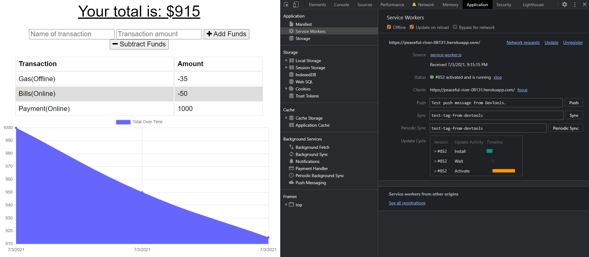

# 19-PWA-Online-Offline-Budget-Trackers

## Description

Refactored an existing budget tracker to create a progressive web app that allows offline use. 

The user will be able to use the app online and even if they go out of service or have an internet outage the app will keep a local cache that will relay the info to the database when back online. 

## Table of Contents
- [Description](#description)
- [Installation](#installation)
- [Usage](#usage)
- [License](#license)
- [Contributors](#contributors)
- [Tests](#tests)
- [Contact](#contact)

## Installation

There are no files to download for this project.

The packages required to run are:

  - compression
  - express
  - lite-server
  - mongoose
  - morgan

## Usage

To start the process, go to the deployed site [here](https://peaceful-river-08131.herokuapp.com/)

To go offline open up the dev tools by inspecting the page. 

Go to application and with the "Update on reload" checked. Select the offline button and refresh the page. You are now offline, enter data and then uncheck offline and refresh. You should see your data is still there and now apart of the database. 

## License

Source link for [MIT](https://opensource.org/licenses/MIT)

## Contributors

Cody Gallagher

## Tests

There are currently no tests for this application.  

## Contact

[GitHub Profile](https://github.com/CodyG-2021)

Email Me -- gallagher2021@gmail.com